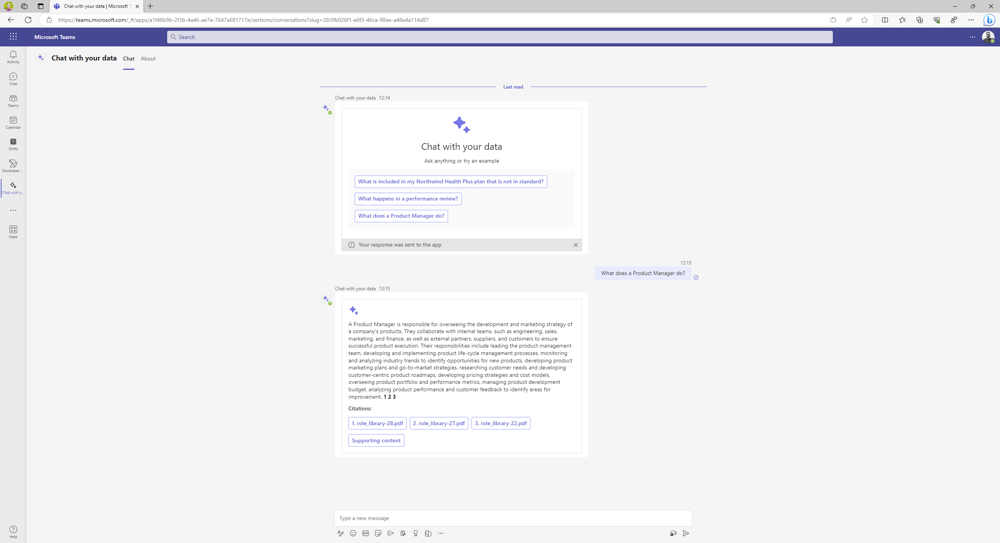

# ChatGPT + Enterprise data with Azure OpenAI and Cognitive Search in Microsoft Teams

These sample apps demonstrate how to use a Microsoft Teams bot to chat with your data using natural language in the flow of work.

It builds on top of the [ChatGPT + Enterprise data with Azure OpenAI and Cognitive Search](https://github.com/Azure-Samples/azure-search-openai-demo) sample.

The apps were built using:

- [Teams Toolkit v5.0.1](https://marketplace.visualstudio.com/items?itemName=TeamsDevApp.ms-teams-vscode-extension), provides tools for building Teams apps, fast.
- [Teams AI Library (public preview)](https://www.npmjs.com/package/@microsoft/teams-ai), provides a Microsoft Teams centric approach to building bots.
- [Adaptive Cards](https://adaptivecards.io), are an open card exchange format enabling developers to exchange UI content in a common and consistent way.
- [Azurite](https://www.npmjs.com/package/azurite), provides emulation for Azure Storage during development.

Two samples apps are provided which can be used whether you have configured authentication on the backend API or not.

- [No authentication](./no-auth/README.md)
- [With authentication](./auth/README.md)
